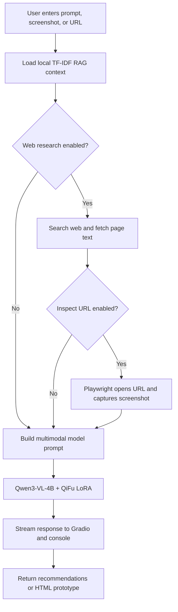
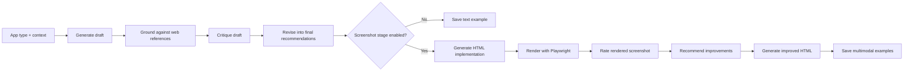
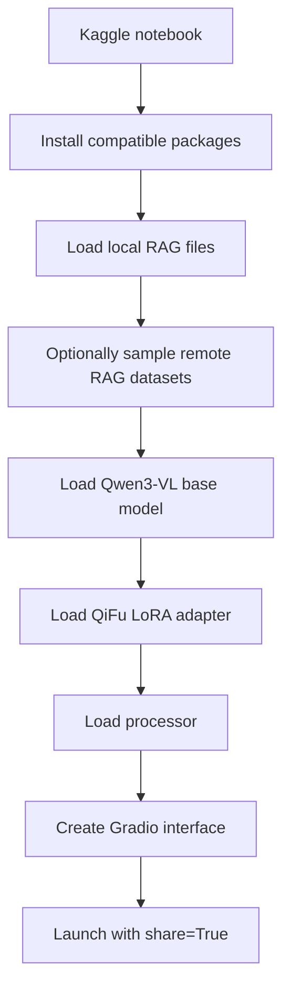
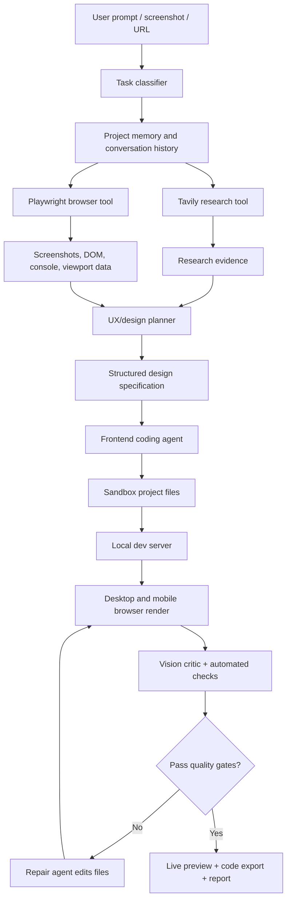
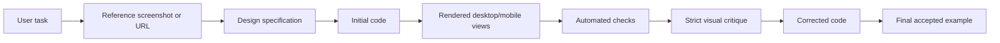

# Infra / Forma

Infra is building **Forma**, a vision-first UI/UX and frontend design agent.

**Tagline:** *See better. Design smarter.*

Forma is intended to accept a plain-language product brief, a screenshot, or a
live website URL and return:

- a direct UI/UX evaluation;
- an overall score and prioritized problems;
- specific recommendations for hierarchy, typography, color, spacing,
  accessibility, responsive behavior, and interaction quality;
- a practical design system and implementation plan;
- a working HTML/CSS/JavaScript prototype when requested;
- eventually, a live editable preview and iterative improvements.

This repository contains the dataset-generation, dataset-preparation, and
Kaggle inference work for the first version. The companion Infra landing page
is a separate Next.js application in the sibling `Landing_Page` directory.

> **Important:** v1 is a working research/beta system, not the final Forma
> product. The v1 model can produce useful UI/UX recommendations, but its
> generated websites are not consistently polished. v2 therefore focuses on
> rendered visual feedback, browser tools, stronger coding capability, and
> high-quality correction data.

---

## 1. Product vision

Most UI generators produce a flat image or an attractive first draft. Forma is
intended to produce the reasoning and implementation underneath the visual
surface:

```text
Brief / screenshot / URL
          │
          ▼
   Understand the product
          │
          ▼
   Understand the visual system
          │
          ▼
   Make a design direction
          │
          ▼
   Turn direction into code
          │
          ▼
   Render, inspect, critique, improve
          │
          ▼
   Deliver an implementation-ready result
```

The product is not intended to be a generic chatbot. It is intended to behave
like a strict senior product designer working together with a frontend
engineer:

- specific instead of vague;
- honest instead of flattering;
- visual instead of text-only;
- responsive instead of desktop-only;
- accessible instead of decorative-only;
- iterative instead of one-shot;
- implementation-aware instead of mockup-only.

---

## 2. Repository scope

```text
dataset_gen_v2/
├── app.py                         # Textual UI and CLI entry point
├── pipeline.py                    # Dataset generation pipeline
├── prepare_training_data.py      # Dataset conversion and merging
├── kaggle_qifu_agent.py           # Kaggle v1 inference agent
├── kaggle_qifu_agent_no_rico.py   # Kaggle agent with only WebSight,
│                                  # Screen2Words, and WebUI remote RAG
├── kaggle_uiux_finetune.ipynb     # Kaggle fine-tuning notebook
├── dataset.jsonl                  # Generated dataset output when present
├── final_dataset/                 # Prepared and merged dataset files
├── QiFu_v1_updated/               # Exportable Kaggle assets and RAG files
├── test_pipeline_e2e.py           # End-to-end pipeline tests
├── test_prepare.py                # Dataset transformation tests
├── test_ui_smoke.py               # UI smoke tests
├── requirements.txt               # Python dependencies
└── README.md                      # This document
```

The sibling landing-page application contains the public Infra/ Forma
marketing site, waitlist database, authentication flow, and Gmail SMTP
notification setup.

---

## 3. What v1 currently does

### Model

The v1 inference application currently loads:

```text
Base model: Qwen/Qwen3-VL-4B-Instruct
Adapter:    EgoisticCoder/QiFu-v1
Runtime:    Transformers + PEFT + PyTorch
```

The adapter is a LoRA-style specialization for UI/UX analysis and design
recommendations. The model accepts text and image inputs and produces text. It
can also generate a complete HTML document when explicitly instructed.

### Inputs

The v1 Gradio app supports:

- a UI screenshot uploaded by the user;
- a website URL;
- a plain-language prompt;
- optional web research;
- optional rendering and screenshot inspection of the supplied URL;
- a configurable maximum output-token limit;
- configurable temperature.

### Outputs

The v1 system asks for:

1. an overall verdict and score;
2. strengths;
3. highest-impact problems;
4. prioritized recommendations;
5. responsive and accessibility guidance;
6. design-system suggestions;
7. an implementation plan;
8. a complete HTML/CSS/JavaScript prototype when requested.

Generation is streamed into Gradio and printed to the Kaggle console. HTML
output is trimmed after the first closing `</html>` tag to reduce accidental
repetition.

### Current v1 flow



### Current v1 RAG

The Kaggle agent has a lightweight local retrieval layer:

- JSONL records are flattened into text;
- `TfidfVectorizer` creates a lexical index;
- cosine similarity retrieves the top matching records;
- retrieved records are inserted into the prompt as supporting references.

The no-Rico version loads these remote samples by default:

- WebSight;
- Screen2Words;
- WebUI.

The current implementation samples a small number of rows to keep startup
reasonable. It is not a production vector database and it does not perform
image retrieval.

### Current v1 web research

The current code uses the `ddgs` package for web search. It can:

- search for UI/UX references;
- fetch page text with `requests` and `BeautifulSoup`;
- optionally open a URL with Playwright;
- capture a screenshot and pass it to the vision model.

This is useful for experimentation, but it is not the final web-agent design.
Forma v2 will use Tavily for controlled search and Playwright for actual visual
inspection. Search results and browser inspection are different capabilities;
Tavily alone cannot reliably tell the model how a website looks.

---

## 4. Dataset-generation pipeline

The dataset generator creates synthetic UI/UX examples through a staged
process instead of a single prompt.



### Core stages

#### 1. Draft

The provider receives an application type and contextual hint and generates a
design concept covering color palette, typography, layout, navigation, one key
screen, and micro-interactions.

#### 2. Ground

The generator retrieves external reference snippets for the application type.
The current generator uses DuckDuckGo through `ddgs`. This stage is intended to
reduce generic advice and expose the model to real design language.

#### 3. Critique

A second model call is instructed to find concrete problems, omissions, and
contradictions in the draft. It is explicitly told not to praise the draft.

#### 4. Revise

The draft and critique are passed into a revision call. The revised result is
the core text training example.

### Optional screenshot stage

The optional screenshot stage adds the behavior required by real visual
analysis:

```text
final recommendations
          ↓
single-file HTML mockup
          ↓
headless Chromium render
          ↓
original screenshot
          ├── rate this UI
          ├── recommend improvements
          └── recreate with better UI
```

This creates training examples matching the deployed use cases: image to
rating, image to improvement recommendations, and image to improved
implementation.

The stage is more expensive because one sample may require up to seven model
calls: draft, critique, revise, implement, rate, improve, and recreate.

### Dual-provider generation

The generator supports two OpenAI-compatible providers. Samples are distributed
round-robin across workers. If one provider fails authentication, the other
worker can continue. Existing output lines are used for basic resume behavior.

---

## 5. Dataset formats

### Raw generated format

`dataset.jsonl` contains one sample per line:

```json
{
  "app_type": "ecommerce app",
  "seed_hint": "target audience: busy professionals",
  "provider": "groq",
  "model": "provider-model-name",
  "draft": "...",
  "grounding": ["..."],
  "critique": "...",
  "final": "...",
  "code": "<!DOCTYPE html>...",
  "screenshot_b64": "...",
  "rating": "...",
  "vision_critique": "...",
  "improved_code": "<!DOCTYPE html>...",
  "status": "done",
  "error": null,
  "timestamp": "2026-09-10T12:00:00+00:00"
}
```

### Training format

`prepare_training_data.py` converts completed rows into chat examples:

```json
{
  "messages": [
    {"role": "user", "content": "Design a UI/UX concept for an ecommerce app..."},
    {"role": "assistant", "content": "..."}
  ],
  "source": "own_dataset"
}
```

Multimodal examples use image content blocks with base64 data URLs.

### Dataset balance

WebSight is much larger than the custom dataset. Merging all of WebSight can
make the final file overwhelmingly code-generation examples and dilute the
actual Forma task. The training job must therefore control sampling ratios.

The important rule is:

```text
Do not let the largest dataset define the model's identity.
```

Oversample high-quality Forma examples and use WebSight as supporting code
coverage, not as the dominant objective.

---

## 6. How the existing external datasets are used

### WebSight

Best fit for HTML/CSS implementation patterns and website code examples. It is
useful for RAG and carefully sampled training, but raw code should be filtered,
deduplicated, and checked for quality before becoming a training target.

### Screen2Words

Useful for screen-description vocabulary and UI element naming. It is not a
direct replacement for design critique training because its task is primarily
screen-to-description.

### WebUI

Useful as structured metadata and design vocabulary: categories, palettes,
fonts, elements, and layout descriptors.

### Rico

Rico can be useful for layout and view-hierarchy retrieval, but it was removed
from the current lightweight Kaggle agent because loading it caused extremely
slow startup and excessive resource use. It should not be added to v2 until it
is preprocessed into a compact, local index.

### Mind2Web, VINS, and interaction datasets

These are more appropriate for a future interaction/action agent than for
direct UI/UX recommendation training. If used, convert them into a separate
tool-use corpus with fields such as:

```json
{
  "screen_state": "...",
  "goal": "...",
  "action": "click search field",
  "selector_or_coordinates": "...",
  "expected_result": "..."
}
```

Do not blindly mix action-prediction rows with design-recommendation rows.

---

## 7. v1 fine-tuning and deployment

The v1 fine-tuning work was performed in Kaggle using Unsloth/PEFT-style LoRA
training on a vision-capable Qwen model. The resulting adapter was published
as:

```text
EgoisticCoder/QiFu-v1
```

The adapter is loaded on top of the base model at inference time. The adapter
does not contain the full base model, which is why the deployment downloads
both the base checkpoint and adapter.

### Kaggle deployment flow



### Important v1 environment issues

The Kaggle environment produced several compatibility problems during
development:

- mismatched PyTorch and TorchAudio CUDA builds;
- incompatible `torchao` versions in PEFT;
- missing `torchvision` for Qwen vision processors;
- mismatched Transformers image-processing internals;
- Gradio package-version conflicts;
- bitsandbytes FP4 errors on CPU/ZeroGPU;
- missing Playwright browser system libraries;
- external websites failing DNS or blocking automation.

The practical solution was to use a clean, compatible Kaggle setup cell, remove
unused `torchaudio`, install matching `torchvision`, avoid loading the model on
CPU-only ZeroGPU, and test with a single generation before enabling the full
agent.

### v1 limitations

The current system is still limited by:

- one relatively small 4B vision-language model;
- mostly one-shot HTML generation;
- no robust visual correction loop;
- lexical TF-IDF retrieval instead of semantic/image retrieval;
- DuckDuckGo rather than a controlled search API;
- no persistent user conversation history;
- no project/version workspace;
- no strong frontend compilation or browser test loop;
- no reliable live preview inside the current Gradio app;
- generated code can be repetitive, visually weak, or broken on mobile;
- web pages may block requests, screenshots, or browser automation.

These are known product limitations, not hidden successes. v1 is a baseline for
collecting real failure cases and improving the system.

---

## 8. Forma v2 target architecture

The central v2 change is to stop treating the model as a one-shot answer
generator. Forma v2 should be an agent with tools, a project workspace, visual
verification, and bounded self-correction.



### v2 tools

#### Tavily

Use Tavily for design references, competitor research, current product
conventions, and technical documentation. Search must be bounded by query
count, domain allowlists, timeout, and source limits. Search results are
evidence, not instructions that the model must copy.

#### Playwright

Use Playwright for opening URLs, capturing desktop and mobile screenshots,
checking interactions, reading DOM structure, collecting console errors, and
testing generated pages in a real browser.

Tavily understands web content. Playwright understands rendered appearance.
Both are required.

#### Sandbox file workspace

Each request should receive a temporary isolated workspace:

```text
workspace/<project-id>/<revision-id>/
├── package.json
├── src/
├── public/
├── screenshots/
├── browser-report.json
└── design-spec.json
```

Generated code must not receive unrestricted access to the host machine. The
agent should be able to read/write only its workspace and use an allowlisted
set of commands.

---

## 9. v2 model strategy

### Vision and UX model

The recommended fine-tuning target is:

```text
Qwen3-VL-8B-Instruct + QLoRA
```

It is a practical upgrade from Qwen3-VL-4B for screenshot analysis, spatial
reasoning, multimodal prompts, and structured design critique while remaining
within the practical range of two T4 GPUs.

### Coding model

For serious frontend/full-stack code generation, use a separate coding model:

```text
Qwen3-Coder-30B-A3B-Instruct
```

It is text-only, so it should receive the structured design specification,
browser errors, screenshot critique, and current project files from the vision
agent. It should not need to interpret the raw screenshot for every coding
step.

### One-model fallback

If the product must run with one local checkpoint, fine-tune Qwen3-VL-8B on
visual UI analysis, structured UX specifications, HTML/CSS/JavaScript
generation, correction traces, accessibility, and responsive reasoning.

This is simpler but weaker than the two-model architecture.

### Do not train from scratch at 1B

Creating a capable 1B multimodal model from scratch is not realistic for this
hardware or project stage. It would require a language model pretraining corpus,
a vision encoder, image-text alignment data, multimodal instruction data,
coding data, agent/tool-use data, and extensive distributed training and
evaluation.

Two T4 GPUs are suitable for QLoRA or small adapter experiments, not for
pretraining a competitive general-purpose vision-coding model from zero.

---

## 10. v2 training data design

The most valuable dataset is not just a screenshot paired with a paragraph. It
is a verified interaction trace:



### Recommended training record

```json
{
  "task": "Create a cyberpunk ecommerce homepage",
  "constraints": ["mobile-first", "accessible contrast", "fast checkout"],
  "reference_screenshots": ["..."],
  "research_evidence": ["..."],
  "design_spec": {
    "information_architecture": "...",
    "layout": "...",
    "tokens": {},
    "components": [],
    "responsive_rules": [],
    "interaction_states": []
  },
  "initial_code": "...",
  "render_report": {},
  "critic_feedback": [],
  "corrected_code": "...",
  "quality_score": 8.7
}
```

### Data priorities

Prefer quality over raw row count:

1. 500–2,000 manually reviewed golden examples;
2. 5,000–20,000 rendered and automatically checked examples;
3. carefully sampled WebSight code examples;
4. screen-description examples for vocabulary;
5. separate browser-action examples for tool-use training.

### Negative and preference data

Create explicit bad-versus-good pairs: broken mobile header versus corrected
header, poor contrast versus accessible contrast, generic card grid versus
intentional hierarchy, excessive empty space versus corrected composition,
duplicate CSS versus clean components, and invalid HTML versus validated HTML.

This is more useful for v2 than simply adding more generic design descriptions.

---

## 11. Quality gates for generated websites

Every generated project should be evaluated before it is shown as complete.

### Automated checks

- HTML and CSS parse successfully;
- no uncaught browser console errors;
- no horizontal overflow at mobile widths;
- required text and CTA are visible;
- images have dimensions and alt text;
- links are not empty;
- keyboard focus is visible;
- contrast is acceptable;
- buttons have hover, focus, disabled, and loading states;
- desktop and mobile screenshots render successfully;
- generated code does not repeat the same section indefinitely.

### Visual checks

The visual critic should score hierarchy, composition, spacing rhythm,
typography, color coherence, content density, alignment, responsive behavior,
visual polish, and fit to the user brief.

The model should not say “production-ready” unless the browser and quality
checks pass. If the page fails, the system should show the failure honestly and
attempt a bounded repair.

---

## 12. History, context, and project memory

Forma should not insert an entire conversation into every model prompt. Store
structured project memory instead:

```json
{
  "project_id": "project_123",
  "brand": "...",
  "audience": "...",
  "product_goal": "...",
  "visual_direction": "...",
  "design_tokens": {},
  "decisions": [],
  "open_issues": [],
  "revisions": [],
  "last_browser_report": {},
  "last_critic_report": {}
}
```

Each revision should store the prompt, retrieved evidence, design spec,
generated files, screenshots, automated report, critic feedback, and
accepted/rejected status.

---

## 13. Gradio v2 interface

The future Gradio interface should contain:

```text
┌─────────────────────────────────────────────────────────────┐
│ Forma                                                       │
├──────────────────────┬──────────────────────────────────────┤
│ Prompt / URL / Image │ Live preview                         │
│                      │ ┌──────────────────────────────────┐ │
│ [Generate]           │ │ rendered website                  │ │
│ [Improve]            │ └──────────────────────────────────┘ │
│                      │ Desktop | Mobile                     │
│ Research controls    │                                      │
│ Browser controls     │ Critique / score / browser report    │
│                      │                                      │
│ Project history      │ Download ZIP / Export code           │
└──────────────────────┴──────────────────────────────────────┘
```

The preview should be isolated in a sandboxed iframe or separate local preview
service. Do not execute arbitrary generated JavaScript in the main Gradio
process.

---

## 14. Local installation

```bash
git clone <repository-url>
cd dataset_gen_v2
python3 -m venv .venv
source .venv/bin/activate
pip install -r requirements.txt
```

For screenshot generation:

```bash
playwright install chromium
```

Run the interactive application and tests:

```bash
python app.py
python test_prepare.py
python test_pipeline_e2e.py
python test_ui_smoke.py
```

---

## 15. Dataset generation usage

The interactive TUI is the main interface:

```bash
python app.py
```

Example command patterns:

```bash
python app.py --limit 50 --provider groq
python app.py --limit 50 --provider openrouter \
  --model "provider/model-name" \
  --output run1.jsonl
```

Inspect dataset schemas before merging:

```bash
python prepare_training_data.py --inspect
```

Merge the custom dataset with a controlled WebSight sample:

```bash
python prepare_training_data.py \
  --own-dataset dataset.jsonl \
  --websight-limit 3000 \
  --output train_merged.jsonl
```

Use all WebSight only deliberately. It can dominate the dataset and change the
model's behavior away from UI/UX critique.

---

## 16. Kaggle v1 setup outline

The exact package versions must be kept compatible with Kaggle's installed
PyTorch/CUDA stack. A typical setup includes:

```bash
pip install -q -U transformers peft accelerate torchvision \
  beautifulsoup4 requests ddgs scikit-learn playwright
pip uninstall -y torchaudio
playwright install chromium
```

Configure environment values before loading the agent:

```python
import os

os.environ["HF_TOKEN"] = "hf_..."
os.environ["MODEL_ID"] = "EgoisticCoder/QiFu-v1"
os.environ["QIFU_ENABLE_REMOTE_RAG"] = "1"
os.environ["QIFU_REMOTE_RAG_ROWS"] = "25"
os.environ["QIFU_RAG_FILES"] = ",".join([
    "/kaggle/input/your-dataset/design_principles.jsonl",
    "/kaggle/input/your-dataset/seed_examples.jsonl",
    "/kaggle/input/your-dataset/generated_examples_groq.jsonl",
])
```

Launch the Gradio test interface:

```python
demo.launch(share=True, server_name="0.0.0.0", server_port=7860)
```

For reliable testing, first run a text-only request, then an uploaded-image
request, then URL inspection. Do not start with a large remote RAG dataset and
full browser automation at the same time.

---

## 17. Security and deployment requirements

Before public launch:

- keep Hugging Face, Tavily, database, and email secrets server-side;
- never hard-code tokens in notebooks or source files;
- rotate the exposed Hugging Face token from earlier experiments;
- sandbox generated code and browser sessions;
- restrict outbound requests and command execution;
- validate URLs to reduce SSRF risk;
- limit page size, screenshot size, and generation time;
- sanitize generated HTML before displaying it;
- do not expose arbitrary filesystem paths;
- log tool calls and failures without logging private credentials;
- add request rate limits;
- add authentication before allowing persistent projects.

The companion landing page uses PostgreSQL, signed HTTP-only sessions, bcrypt
password hashing, and Gmail SMTP through an App Password. Its production
environment must provide the database URL, auth secret, and SMTP credentials.

---

## 18. Roadmap

### Completed or available in v1

- [x] Synthetic UI/UX dataset generator
- [x] Generate → ground → critique → revise pipeline
- [x] Optional implement → render → rate → improve → recreate pipeline
- [x] Playwright screenshot generation in the dataset pipeline
- [x] Dual-provider generation support
- [x] JSONL output and chat-format conversion
- [x] Qwen3-VL LoRA adapter training workflow
- [x] Kaggle Gradio inference agent
- [x] Streaming model output
- [x] Local lexical RAG
- [x] WebSight, Screen2Words, and WebUI sampled RAG support
- [x] Website text fetching and optional URL screenshot inspection
- [x] Published v1 adapter: `EgoisticCoder/QiFu-v1`
- [x] Infra landing page with waitlist, authentication, and database-backed
      early-access flow in the companion app

### v2 — model and agent

- [ ] Move vision model from Qwen3-VL-4B to Qwen3-VL-8B QLoRA
- [ ] Evaluate a separate Qwen3-Coder model for frontend implementation
- [ ] Replace DuckDuckGo research with Tavily
- [ ] Add Playwright browser tools as first-class agent tools
- [ ] Add isolated project workspaces
- [ ] Add desktop/mobile render loop
- [ ] Add visual critic and automated browser checks
- [ ] Add bounded automatic repair iterations
- [ ] Add structured design-spec output
- [ ] Add real project history and versioning
- [ ] Add live preview inside Gradio
- [ ] Add downloadable project ZIP

### v2 — data and evaluation

- [ ] Build a curated golden UI/UX dataset
- [ ] Add verified rendered correction traces
- [ ] Add responsive desktop/mobile pairs
- [ ] Add accessibility and interaction-state examples
- [ ] Add negative and preference pairs
- [ ] Build a held-out UI/UX evaluation set
- [ ] Measure visual quality, code validity, accessibility, and responsiveness
- [ ] Preprocess Rico into compact layout/view-hierarchy records if needed
- [ ] Keep interaction-action datasets separate from design-generation data

### Product future

- [ ] Persistent user projects
- [ ] Design-token editor
- [ ] Multi-page website generation
- [ ] Framework output: HTML, React, Next.js, Tailwind
- [ ] GitHub export and pull-request generation
- [ ] Figma/design-tool integration
- [ ] Team collaboration and review comments
- [ ] Model feedback collection with opt-in training data
- [ ] Hosted API and usage-based inference
- [ ] Enterprise private deployment

---

## 19. Definition of success

Forma v2 should not be judged by whether it can produce a large amount of HTML.
It should be judged by whether a user can give it a brief or website and get a
result that is:

1. visually coherent;
2. responsive on desktop and mobile;
3. accessible enough to ship;
4. technically valid;
5. specific to the product and audience;
6. honest about defects;
7. editable by a developer;
8. improved through browser feedback;
9. reproducible through project history.

The main engineering principle is:

```text
Generate less. Verify more. Improve with evidence.
```
